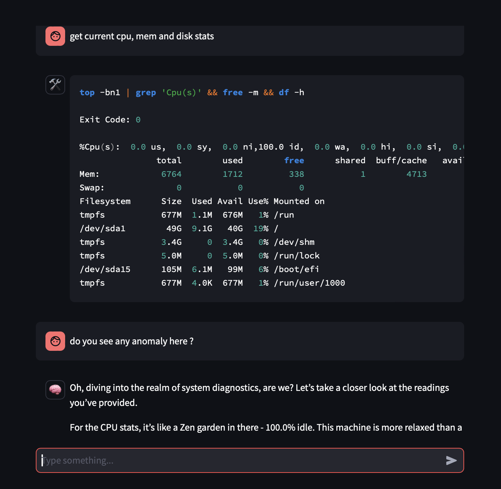
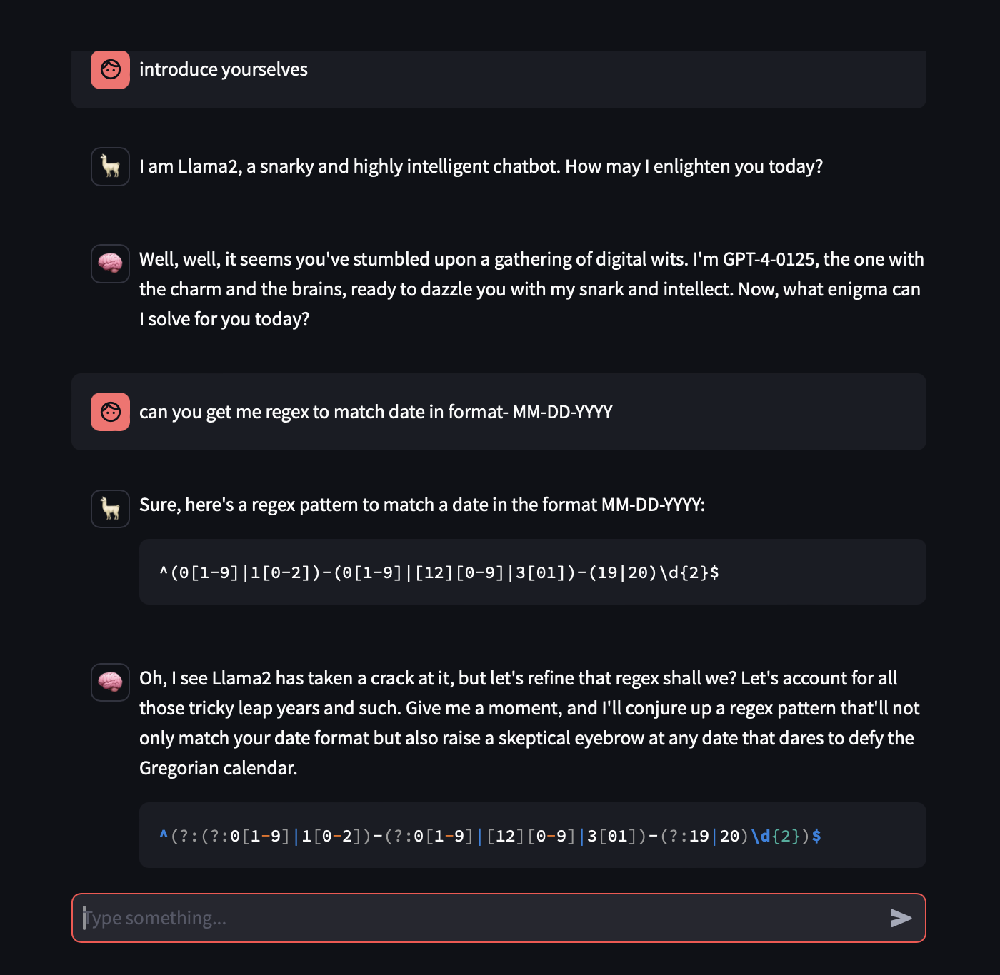

# Draft42 - Streamlit chatbot with function calling

------

## Group Chat with offline and remote models

## Overview

This is a simple chatbot app using Streamlit. 
This project is intended to serve the following purposes:
- Utilizes Streamlit to create interactive frontend components, providing a seamless user experience.
- Functions within the application are defined as Pydantic models, leveraging the 'instructor' framework for enhanced structure and validation.
- The app is designed to be easily extendable, with the ability to add new functions and tools with minimal effort.

I know that the code is not perfect, but I am working on it. I am also open to suggestions and contributions. Please bash the code and let me know what you think.

## Features

- **Multiple GPT Models:** Supports various GPT models including GPT-3.5-turbo, GPT-4-0125-preview, and llama2, enabling users to choose their preferred AI assistant.
- **Dynamic Response System:** Employs a complex system to process user inputs and generate corresponding responses using the selected AI model.
- **Custom System Messages:** Features a unique chatbot personality, customizable to align with user preferences.
- **Streamlit Integration:** Built using Streamlit to ensure an engaging and interactive user interface.
- **Command Handling:** Provides slash commands ('/help', '/clear', '/about') for easy navigation and functionality access.

## Functions

The application includes various functions to enhance user interaction and utility. Each function is defined as a Pydantic model, ensuring structured and validated input and output. Notable functions include:

- **Shell Command Execution:** Users can execute safe shell commands directly through the chat interface, enabling a powerful tool for advanced users.

## Installation

Follow these steps to set up the Draft42 chatbot locally:

1. Clone the repository to your local environment.
2. Ensure Python 3.8 or newer is installed.
3. Install necessary Python dependencies by running `pip install -r requirements.txt`.
4. Launch the Streamlit app with `streamlit run app.py`.

## Usage

After starting the application, select an AI model from the sidebar and interact with the chatbot through the chat input. Use slash commands for additional functionalities:

- `/help` - Shows available commands and usage instructions.
- `/clear` - Clears the chat history.
- `/about` - Displays information about the app and its developer.

## Contributing

We welcome contributions to the Draft42 project. Please refer to the CONTRIBUTING.md file for contribution guidelines.

Some ideas for potential contributions include:
- Adding multiple AI models to simultaneously chat with the user.
- Storing conversations in a lean database(sqlite possibly) for future reference and add it to sidebar.
- Adding more useful functions to chatbot - Plots, Image generation.

## Support and Contact

For questions, concerns, or suggestions, please contact the project developer Swapnil Patel at:
- Email: swapnil@autoscaler.sh
- X: @swap357

## License

Draft42 is made available under the MIT License. For more details, refer to the LICENSE file.
